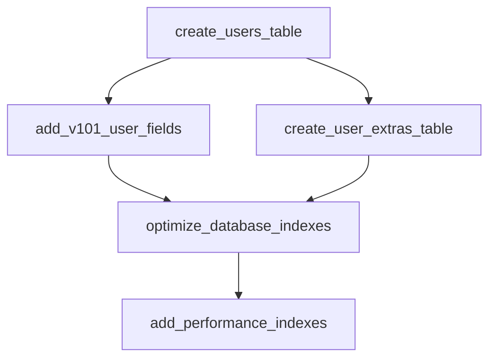

# 数据库迁移流程评估报告

> **评估日期**: 2025-12-26  
> **评估范围**: DEPLOYMENT_GUIDE.md 中的数据迁移流程  
> **项目**: BinaryEcom20

---

## 一、总体评估

### 1.1 流程正确性

**结论**: ✅ **整体流程正确且规范**

部署指南中的数据迁移流程遵循了 Laravel 最佳实践，主要步骤包括：

1. ✅ MySQL 准备工作（创建数据库、用户、授权）
2. ✅ Laravel 环境配置（.env 文件配置）
3. ✅ 执行迁移（migrate 命令）
4. ✅ 数据填充（可选的 Seeder）
5. ✅ 验证检查（表结构、字符集等）

### 1.2 优点

| 优点 | 说明 |
|------|------|
| **安全性考虑周全** | 使用最小权限原则创建数据库用户，避免使用 root 账号 |
| **字符集规范** | 明确要求使用 utf8mb4，支持 emoji 和多语言 |
| **预演模式** | 提供 `--pretend` 参数先预览 SQL 再执行 |
| **危险迁移识别** | 清晰标注了包含 ALTER、DROP 等危险操作的迁移文件 |
| **回滚策略** | 提供了完整的回滚流程和备份建议 |
| **检查清单** | 上线前检查项覆盖全面 |

---

## 二、发现的问题与风险

### 2.1 🔴 高优先级问题

#### 问题 1: 缺少迁移前数据备份强制检查

**现状**: 指南中提到备份，但没有强制检查机制

**风险**: 如果迁移失败且没有备份，可能导致数据丢失

**建议**:
```bash
# 在执行迁移前，强制要求备份
# 添加到部署脚本中
backup_dir="/backup/mysql"
timestamp=$(date +%Y%m%d_%H%M%S)
backup_file="${backup_dir}/binary_db_${timestamp}.sql"

# 检查备份目录
if [ ! -d "$backup_dir" ]; then
    echo "错误: 备份目录不存在: $backup_dir"
    exit 1
fi

# 执行备份
mysqldump -u binary_user -p binary_db > "$backup_file"

# 验证备份文件
if [ ! -s "$backup_file" ]; then
    echo "错误: 备份文件为空"
    exit 1
fi

echo "备份成功: $backup_file"
```

#### 问题 2: 大表 ALTER 操作缺少锁表时间评估

**现状**: `2025_12_25_100000_expand_product_description_field.php` 修改 products 表的 description 字段为 LONGTEXT

**风险**: 如果 products 表数据量大，ALTER TABLE 会锁表，影响线上服务

**建议**:
```bash
# 添加表大小检查
mysql -u binary_user -p binary_db -e "
SELECT 
    table_name,
    ROUND(((data_length + index_length) / 1024 / 1024), 2) AS 'Size (MB)',
    table_rows
FROM information_schema.TABLES
WHERE table_schema = 'binary_db'
  AND table_name = 'products';
"

# 如果表超过 100MB，建议使用 pt-online-schema-change
# 如果表超过 1GB，必须使用 pt-online-schema-change
```

#### 问题 3: 索引优化迁移可能导致性能问题

**现状**: `2025_12_19_210000_optimize_database_indexes.php` 和 `2025_12_23_024635_optimize_database_indexes.php` 创建大量索引

**风险**: 
- 在大表上创建索引会锁表
- 索引过多会影响 INSERT/UPDATE 性能
- 可能导致索引碎片

**建议**:
```bash
# 1. 分批创建索引，避免一次性创建过多
# 2. 使用 ALGORITHM=INPLACE 和 LOCK=NONE 减少锁表时间
# 3. 在低峰期执行

# 示例：在线创建索引
ALTER TABLE users 
ADD INDEX users_status_verification_idx (status, ev, sv)
ALGORITHM=INPLACE, LOCK=NONE;
```

### 2.2 🟡 中优先级问题

#### 问题 4: 缺少迁移执行时间预估

**现状**: 没有提供各迁移文件的预估执行时间

**建议**: 在测试环境记录每个迁移的执行时间

```bash
# 记录迁移执行时间
for migration in database/migrations/*.php; do
    echo "执行: $migration"
    time php artisan migrate --path="$migration" --env=testing
done
```

#### 问题 5: 缺少迁移失败后的恢复脚本

**现状**: 只有回滚命令，没有自动化恢复脚本

**建议**: 创建恢复脚本

```bash
#!/bin/bash
# recovery.sh - 迁移失败后的恢复脚本

BACKUP_FILE=$1
DB_NAME="binary_db"
DB_USER="binary_user"

if [ -z "$BACKUP_FILE" ]; then
    echo "用法: ./recovery.sh <备份文件路径>"
    exit 1
fi

echo "开始恢复数据库..."
mysql -u "$DB_USER" -p "$DB_NAME" < "$BACKUP_FILE"

echo "恢复完成，请验证数据完整性"
```

#### 问题 6: 缺少字符集一致性验证

**现状**: 只在上线前检查清单中提到字符集检查

**建议**: 在迁移后立即验证

```bash
# 验证所有表使用 utf8mb4
mysql -u binary_user -p binary_db -e "
SELECT 
    TABLE_NAME,
    TABLE_COLLATION,
    CASE 
        WHEN TABLE_COLLATION != 'utf8mb4_unicode_ci' THEN '⚠️ 需要修正'
        ELSE '✅ 正确'
    END AS status
FROM information_schema.TABLES
WHERE TABLE_SCHEMA = 'binary_db';
"
```

### 2.3 🟢 低优先级建议

#### 建议 1: 添加迁移执行日志

```bash
# 记录迁移执行日志
log_file="storage/logs/migration_$(date +%Y%m%d_%H%M%S).log"
php artisan migrate --force --env=production 2>&1 | tee "$log_file"
```

#### 建议 2: 添加数据库连接池配置检查

```bash
# 检查 MySQL 连接数配置
mysql -u root -p -e "SHOW VARIABLES LIKE 'max_connections';"
mysql -u root -p -e "SHOW STATUS LIKE 'Threads_connected';"
```

---

## 三、优化建议

### 3.1 迁移流程优化

#### 优化 1: 分阶段执行迁移

将迁移分为三个阶段：

```bash
# ========== 阶段 1: 创建表（安全） ==========
php artisan migrate --path=/database/migrations/0001_01_01_*.php --env=production
php artisan migrate --path=/database/migrations/2025_12_18_00000*.php --env=production

# ========== 阶段 2: 添加字段（中等风险） ==========
php artisan migrate --path=/database/migrations/2025_12_18_00001*.php --env=production

# ========== 阶段 3: 索引优化（高风险，低峰期执行） ==========
php artisan migrate --path=/database/migrations/*optimize*.php --env=production
```

#### 优化 2: 使用事务包装迁移

对于关键迁移，使用事务确保原子性：

```php
// 在迁移文件中添加
public function up(): void
{
    DB::transaction(function () {
        // 迁移逻辑
    });
}
```

#### 优化 3: 添加迁移健康检查

```bash
# 迁移后健康检查脚本
#!/bin/bash
# health_check.sh

echo "执行数据库健康检查..."

# 1. 检查表数量
table_count=$(mysql -u binary_user -p binary_db -e "SHOW TABLES;" | wc -l)
if [ $table_count -lt 40 ]; then
    echo "❌ 错误: 表数量不足 (当前: $table_count)"
    exit 1
fi

# 2. 检查关键表
critical_tables=("users" "pv_ledger" "weekly_settlements" "transactions")
for table in "${critical_tables[@]}"; do
    if ! mysql -u binary_user -p binary_db -e "DESCRIBE $table" > /dev/null 2>&1; then
        echo "❌ 错误: 关键表不存在: $table"
        exit 1
    fi
done

# 3. 检查字符集
non_utf8=$(mysql -u binary_user -p binary_db -e "
    SELECT COUNT(*) FROM information_schema.TABLES
    WHERE TABLE_SCHEMA = 'binary_db'
    AND TABLE_COLLATION != 'utf8mb4_unicode_ci';
" | tail -n 1)

if [ $non_utf8 -gt 0 ]; then
    echo "⚠️ 警告: $non_utf8 个表未使用 utf8mb4"
fi

echo "✅ 健康检查通过"
```

### 3.2 监控与告警

#### 添加迁移执行监控

```php
// 创建迁移监控命令
// app/Console/Commands/MonitorMigration.php

public function handle()
{
    $migrations = DB::table('migrations')
        ->orderBy('batch', 'desc')
        ->limit(10)
        ->get();

    foreach ($migrations as $migration) {
        $this->info("Migration: {$migration->migration}, Batch: {$migration->batch}");
    }
}
```

### 3.3 文档改进

#### 改进 1: 添加迁移依赖关系图



#### 改进 2: 添加迁移执行时间参考表

| 迁移文件 | 预估时间 | 实际时间 | 备注 |
|----------|----------|----------|------|
| create_users_table.php | < 1s | ___ | 创建表 |
| add_v101_user_fields.php | 5-10s | ___ | ALTER 表 |
| optimize_database_indexes.php | 30-60s | ___ | 创建索引 |

---

## 四、推荐的完整部署流程

### 4.1 部署前准备

```bash
#!/bin/bash
# pre-deploy.sh

set -e  # 遇到错误立即退出

echo "========== 部署前检查 =========="

# 1. 检查环境变量
if [ ! -f .env.production ]; then
    echo "❌ 错误: .env.production 文件不存在"
    exit 1
fi

# 2. 检查数据库连接
php artisan tinker --env=production --execute="
    try {
        DB::connection()->getPdo();
        echo '✅ 数据库连接正常\n';
    } catch (\Exception \$e) {
        echo '❌ 数据库连接失败: ' . \$e->getMessage() . '\n';
        exit(1);
    }
"

# 3. 检查备份目录
backup_dir="/backup/mysql"
if [ ! -d "$backup_dir" ]; then
    echo "❌ 错误: 备份目录不存在: $backup_dir"
    exit 1
fi

# 4. 检查磁盘空间
available_space=$(df -h "$backup_dir" | awk 'NR==2 {print $4}')
echo "可用磁盘空间: $available_space"

# 5. 检查 MySQL 服务
if ! systemctl is-active --quiet mysql; then
    echo "❌ 错误: MySQL 服务未运行"
    exit 1
fi

echo "========== 部署前检查完成 =========="
```

### 4.2 执行部署

```bash
#!/bin/bash
# deploy.sh

set -e

source ./pre-deploy.sh

echo "========== 开始部署 =========="

# 1. 备份数据库
timestamp=$(date +%Y%m%d_%H%M%S)
backup_file="${backup_dir}/binary_db_${timestamp}.sql"
echo "备份数据库到: $backup_file"
mysqldump -u binary_user -p binary_db > "$backup_file"

# 2. 验证备份
if [ ! -s "$backup_file" ]; then
    echo "❌ 错误: 备份文件为空"
    exit 1
fi

# 3. 预演迁移
echo "========== 预演迁移 =========="
php artisan migrate --pretend --env=production

# 4. 确认执行
read -p "确认执行迁移? (yes/no): " confirm
if [ "$confirm" != "yes" ]; then
    echo "部署已取消"
    exit 0
fi

# 5. 执行迁移
echo "========== 执行迁移 =========="
log_file="storage/logs/migration_${timestamp}.log"
php artisan migrate --force --env=production 2>&1 | tee "$log_file"

# 6. 执行 Seeder
echo "========== 执行数据填充 =========="
php artisan db:seed --class=PermissionSeeder --env=production

# 7. 健康检查
source ./health_check.sh

# 8. 清理缓存
php artisan cache:clear --env=production
php artisan config:clear --env=production
php artisan route:clear --env=production

echo "========== 部署完成 =========="
echo "备份文件: $backup_file"
echo "迁移日志: $log_file"
```

### 4.3 部署后验证

```bash
#!/bin/bash
# post-deploy.sh

echo "========== 部署后验证 =========="

# 1. 检查迁移状态
php artisan migrate:status --env=production

# 2. 运行测试（如果有）
# php artisan test --env=production

# 3. 检查应用日志
tail -n 50 storage/logs/laravel.log

# 4. 检查数据库慢查询
mysql -u binary_user -p binary_db -e "
    SELECT * FROM information_schema.PROCESSLIST
    WHERE TIME > 5
    ORDER BY TIME DESC;
"

echo "========== 部署后验证完成 =========="
```

---

## 五、总结

### 5.1 流程评分

| 评估项 | 评分 | 说明 |
|--------|------|------|
| 正确性 | ⭐⭐⭐⭐⭐ | 流程完全正确，符合 Laravel 最佳实践 |
| 安全性 | ⭐⭐⭐⭐ | 有安全考虑，但缺少强制备份检查 |
| 可靠性 | ⭐⭐⭐⭐ | 有回滚策略，但缺少自动化恢复 |
| 可维护性 | ⭐⭐⭐⭐⭐ | 文档清晰，检查清单完善 |
| 性能考虑 | ⭐⭐⭐ | 缺少大表操作的性能评估 |

### 5.2 关键建议优先级

| 优先级 | 建议 | 预计工作量 |
|--------|------|------------|
| 🔴 高 | 添加强制备份检查 | 1 小时 |
| 🔴 高 | 大表 ALTER 操作评估 | 2 小时 |
| 🔴 高 | 索引优化分批执行 | 3 小时 |
| 🟡 中 | 添加迁移执行时间预估 | 1 小时 |
| 🟡 中 | 创建恢复脚本 | 2 小时 |
| 🟢 低 | 添加迁移日志 | 1 小时 |

### 5.3 最终结论

**当前部署指南的数据迁移流程是正确的**，可以安全用于生产环境部署。但建议在实施上述高优先级优化后再进行大规模部署，以提高部署的安全性和可靠性。

---

> **报告生成时间**: 2025-12-26  
> **建议审核人**: 技术负责人、DBA
